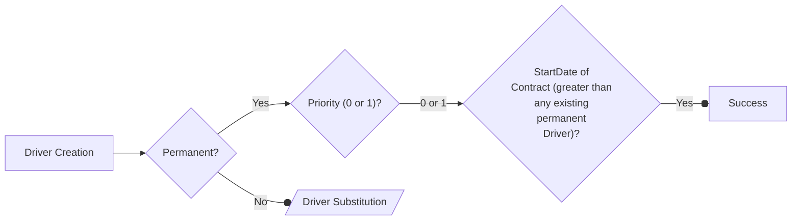
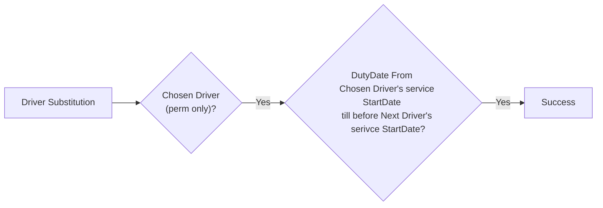
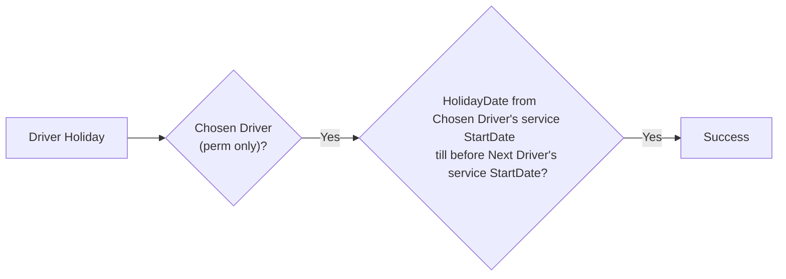

```mermaid
    flowchart LR
    AC[Driver Creation]-->Q1{Permanent?}
    Q1-->|Yes| Q2{"Priority (0 or 1)?"}
    Q1--o|No| A2[/Driver Substitution/]
    Q2-->|0 or 1| Q3{"StartDate of 
    Contract (greater than 
    any existing 
    permanent 
    Driver)?"}
    Q3--o|Yes| A1[Success]

```

```mermaid
    flowchart LR
    AS[Driver Substitution]-->Q1{"Chosen Driver 
    (perm only)?"}
    Q1-->|Yes| Q2{"DutyDate From 
    Chosen Driver's service StartDate 
    till before Next Driver's 
    serivce StartDate?"}
    Q2-->|Yes| A2[Success]
```

```mermaid
    flowchart LR
    AH[Driver Holiday]-->Q1{"Chosen Driver
    (perm only)?"}
    Q1-->|Yes| Q2{"HolidayDate from 
    Chosen Driver's service StartDate 
    till before Next Driver's 
    service StartDate?"}
    Q2-->|Yes| A3[Success]
```
