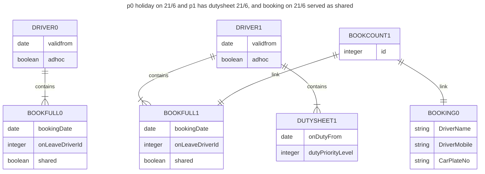
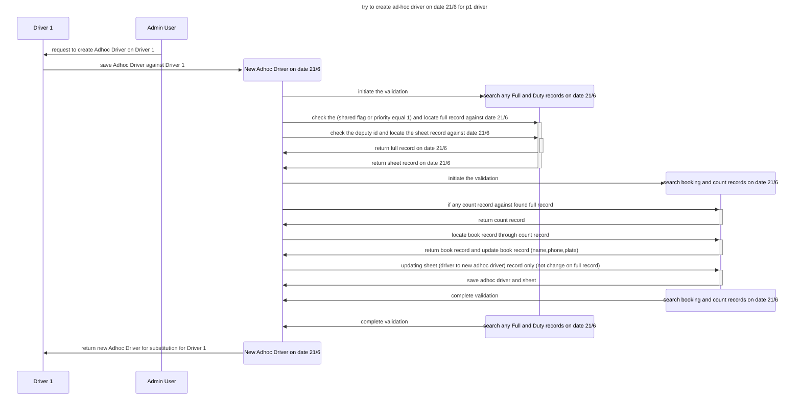
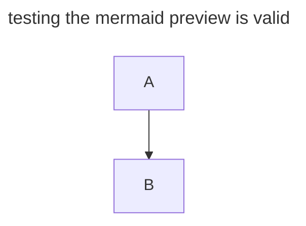

```mermaid
---
title:  p0 holiday on 21/6 and p1 has dutysheet 21/6, and booking on 21/6 served as shared
---
    erDiagram
    DRIVER0 {
        date validfrom
        boolean adhoc

    }
    DRIVER1 {
        date validfrom
        boolean adhoc
    }
    BOOKFULL0 {
        date bookingDate
        integer onLeaveDriverId
        boolean shared
    }
    BOOKFULL1 {
        date bookingDate
        integer onLeaveDriverId
        boolean shared
    }    
    DUTYSHEET1{
        date onDutyFrom
        integer dutyPriorityLevel
    }
    BOOKING0 {
        string DriverName
        string DriverMobile
        string CarPlateNo
    }
    BOOKCOUNT1 {
        integer id
    }
    DRIVER0||--|{BOOKFULL0 : contains
    DRIVER1||--|{BOOKFULL1 : contains
    DRIVER1||--|{DUTYSHEET1: contains
    BOOKCOUNT1||--||BOOKFULL1: link
    BOOKCOUNT1||--||BOOKING0: link

```

```mermaid
---
title: try to create ad-hoc driver on date 21/6 for p1 driver
---
    sequenceDiagram
        participant P1 as Driver 1
        participant A0 as Admin User
        A0->>P1: request to create Adhoc Driver on Driver 1
        create participant N1 as New Adhoc Driver on date 21/6
        P1->>N1: save Adhoc Driver against Driver 1
        create participant F1 as search any Full and Duty records on date 21/6
        N1->>F1: initiate the validation
        N1->>+F1: check the (shared flag or priority equal 1) and locate full record against date 21/6
        N1->>+F1: check the deputy id and locate the sheet record against date 21/6
        F1->>-N1: return full record on date 21/6
        F1->>-N1: return sheet record on date 21/6
        create participant F2 as search booking and count records on date 21/6
        N1->>F2: initiate the validation
        N1->>+F2: if any count record against found full record
        F2->>-N1: return count record
        N1->>+F2: locate book record through count record
        F2->>-N1: return book record and update book record (name,phone,plate)
        N1->>+F2: updating  sheet (driver to new adhoc driver) record only  (not change on full record)
        F2->>-N1: save adhoc driver and sheet
        destroy F2
        F2->>N1: complete validation

        destroy F1
        F1->>N1: complete validation
        destroy N1
        N1->>P1: return new Adhoc Driver for substitution for Driver 1


```

```mermaid
---
title: testing the mermaid preview is valid
---
graph TD;
    A-->B;

```