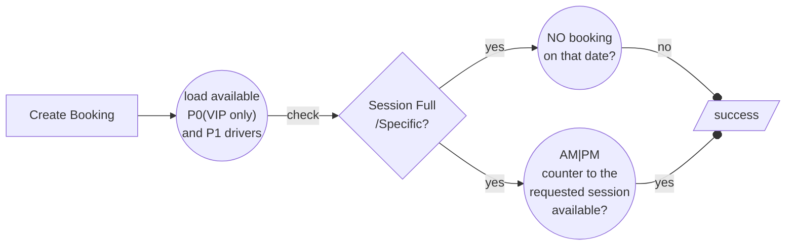
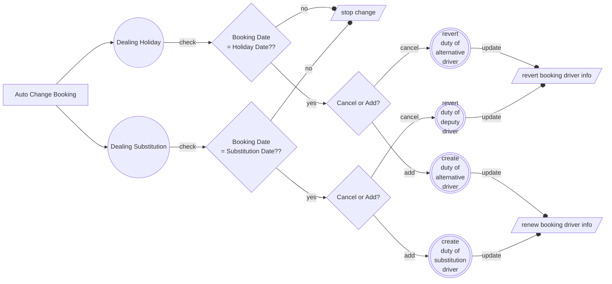

```mermaid
    flowchart LR
    AB["Create Booking
    "]-->QD(("load available 
    P0(VIP only)
    and P1 drivers"))
    QD-->|check|Q2{"Session Full
    /Specific?"}
    Q2-->|yes|Q3(("NO booking 
    on that date?"))    
    Q3--o|no|A1[/success/]
    Q2-->|yes|Q4(("AM|PM 
    counter to the 
    requested session
    available?"))
    Q4--o|yes|A1
```

```mermaid
    flowchart LR
    AC["Auto Change Booking"]-->QH(("Dealing Holiday"))
    QH-->|check|QH1{"Booking Date 
    = Holiday Date??"}
    QH1--o|no|A1[/stop change/]
    QH1-->|yes|QH2{"Cancel or Add?"}
    QH2-->|cancel|QC1((("revert 
    duty of 
    alternative 
    driver")))
    QC1--o|update|QC2[/revert booking driver info/]
    QH2-->|add|QA1((("create 
    duty of 
    alternative 
    driver")))
    QA1--o|update|QA2[/renew booking driver info/]
    AC-->QS(("Dealing Substitution"))
    QS-->|check|QS1{"Booking Date 
    = Substitution Date??"}
    QS1--o|no|A1
    QS1-->|yes|QS2{"Cancel or Add?"}
    QS2-->|cancel|QC3((("revert 
    duty of 
    deputy 
    driver")))
    QC3--o|update|QC2
    QS2-->|add|QA3((("create 
    duty of
    substitution 
    driver")))
    QA3--o|update|QA2
```